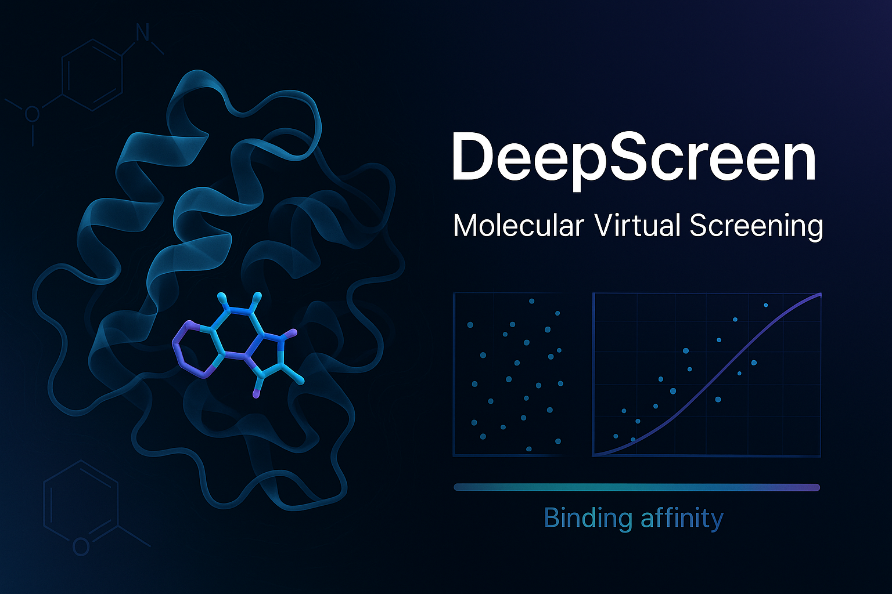

DeepScrean
==========

### Fast, scalable, and accurate small-molecule virtual screening via multi-stage docking + rescoring.

Description
-----------

DeepScrean is a virtual screening pipeline that combines the speed of AutoDock Vina with the accuracy of Boltz2 rescoring. It implements a hierarchical (multi-stage) screening strategy: a lightweight first pass aggressively narrows the library, and a second, more expressive stage refines and re-ranks promising candidates. The result is high throughput without sacrificing enrichment quality.

VinaBolt is engine-agnostic at the orchestration layer and can be adapted to different protein targets, ligand libraries, and cluster environments.

